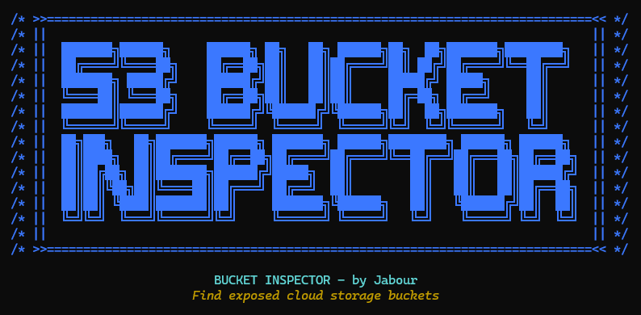

<p align="center">
  
</p>

<div align="center">


[](https://github.com/yourusername)

*A powerful multi-cloud scanning tool that detects public buckets, misconfigurations, and unauthorized access across AWS, Azure, and Google Cloud.*

</div>

---


## ✨ Key Features

<div align="center">
<table>
<tr>
<td width="50%">

### 🔐 Security Scanning
- Multi-cloud coverage (AWS, Azure, GCP)
- **NEW:** Account-level bucket discovery
- Public bucket and container detection
- Anonymous file listing
- Security misconfiguration discovery
- ACL and policy analysis

</td>
<td width="50%">

### 💡 Intelligent Discovery
- Smart bucket name generation
- S3 URL parsing (`bucket-name.s3.amazonaws.com`)
- Region and environment permutations
- Cloud provider-specific patterns
- API-based account discovery
- Works without API keys for public scanning

</td>
</tr>
<tr>
<td>

### 🔄 Performance
- Multi-threaded scanning
- Fast response times
- Efficient resource usage
- Configurable thread limits
- Error handling and recovery
- Handle large domain lists

</td>
<td>

### 📊 Reporting
- Rich console output with color-coding
- JSON export for automation
- CSV export for spreadsheet analysis
- Detailed security findings
- Summary statistics by provider

</td>
</tr>
</table>
</div>

---

## 📋 Table of Contents

- [Installation](#-installation)
- [Usage Modes](#-usage-modes)
- [Command Line Options](#-command-line-options)
- [Examples](#-examples)
- [API Keys](#-api-keys)
- [How It Works](#-how-it-works)
- [Troubleshooting](#-troubleshooting)
- [Security Notes](#-security-notes)
- [License](#-license)

---

## 🚀 Installation

```bash
# Clone the repository
git clone https://github.com/J4B0UR/bucket-inspector.git
cd bucket-inspector

# Install dependencies
pip install -r requirements.txt

# Optional: Configure API keys for account-level scanning
cp .env.example .env
# Edit .env with your cloud credentials
```

---

## 🎯 Usage Modes

BUCKET INSPECTOR offers two powerful scanning modes:

### 1. Domain-Based Scanning

Generates potential bucket names based on the domains you provide and checks if they exist and are publicly accessible.

```bash
python bucket_inspector.py -d example.com -o results.json
```

**Best for:**
- External security assessments
- Third-party security testing
- When you don't have API credentials
- Checking for public exposure

### 2. Account-Level Scanning

Lists and checks ALL buckets in your authenticated cloud accounts, regardless of naming patterns.

```bash
python bucket_inspector.py --scan-account aws -o results.json
```

**Best for:**
- Internal security audits
- Complete cloud resource inventory
- Compliance assessments
- Security posture management

### 3. Comprehensive Mode (Both Together)

Combines both approaches for maximum coverage.

```bash
python bucket_inspector.py -d example.com --scan-account all -o results.json
```

---

## ⚙️ Command Line Options

| Option | Description |
|--------|-------------|
| `-d, --domains` | Comma-separated list of domains, bucket names, or S3 URLs |
| `-f, --file` | File containing list of domains or bucket names (one per line) |
| `-o, --output` | JSON file for detailed results |
| `--csv` | Export results to CSV file |
| `-v, --verbose` | Enable verbose output |
| `-t, --threads` | Number of concurrent threads (default: 10) |
| `--scan-account` | Scan all buckets in the specified cloud account (`aws`, `azure`, `gcp`, or `all`) |
| `--disable-aws` | Skip AWS S3 scanning |
| `--disable-azure` | Skip Azure Blob Storage scanning |
| `--disable-gcp` | Skip Google Cloud Storage scanning |
| `--wordlist` | Additional wordlist file for bucket name generation |

---

## 📝 Examples

### Basic Domain Scanning

```bash
# Scan a single domain
python bucket_inspector.py -d example.com -o results.json

# Scan multiple domains
python bucket_inspector.py -d example.com,example.org -o results.json --csv results.csv

# Scan from a file
python bucket_inspector.py -f domains.txt -o results.json
```

### Account-Level Scanning

```bash
# Scan all buckets in your AWS account
python bucket_inspector.py --scan-account aws -o aws_results.json

# Scan across all cloud providers
python bucket_inspector.py --scan-account all -o cloud_inventory.json

# Combine with domain scanning
python bucket_inspector.py -d example.com --scan-account aws -o complete_results.json
```

### Advanced Options

```bash
# Use a custom wordlist for more bucket names
python bucket_inspector.py -d example.com -o results.json --wordlist custom_words.txt

# Fast scan with more threads
python bucket_inspector.py -d example.com -t 20 -o results.json

# Scan only specific cloud providers
python bucket_inspector.py -d example.com --disable-azure --disable-gcp
```

### Public Dataset Testing

```bash
# Test the tool with these known public buckets
python bucket_inspector.py -d commoncrawl,noaa-goes16,azureopendatastorage,gcp-public-data-landsat
```

---

## 🔑 API Keys

BUCKET INSPECTOR operates in two distinct modes:

### Anonymous Mode (No Keys Required)

- **Domain-based scanning only**
- Detects publicly accessible buckets
- Lists public files and containers
- Identifies common misconfigurations
- Works across all cloud providers

### Authenticated Mode (With API Keys)

- **Enables account-level scanning**
- Discovers ALL your cloud buckets
- Enhanced security analysis
- Detailed permission inspection
- Comprehensive internal auditing

### Setting Up API Keys

For account-level scanning, configure your cloud credentials:

**AWS:**
```bash
# Option 1: AWS CLI
aws configure

# Option 2: Environment variables
export AWS_ACCESS_KEY_ID="your_access_key"
export AWS_SECRET_ACCESS_KEY="your_secret_key"
```

**Azure:**
```bash
# Set environment variables
export AZURE_STORAGE_CONNECTION_STRING="your_connection_string"
export AZURE_SUBSCRIPTION_ID="your_subscription_id"
```

**GCP:**
```bash
# Set application credentials
export GOOGLE_APPLICATION_CREDENTIALS="path/to/credentials.json"
```

---

## 🧠 How It Works

<div align="center">
<table>
<tr>
<th>Domain-Based Scanning</th>
<th>Account-Level Scanning</th>
</tr>
<tr>
<td>

1. Parse input domains/URLs
2. Generate potential bucket names
3. Check cloud providers for matches
4. Test for public accessibility
5. Analyze security configurations
6. Generate detailed reports

</td>
<td>

1. Authenticate with cloud providers
2. List ALL buckets in your accounts
3. Check each bucket for public access
4. Analyze permissions and policies
5. Identify misconfigurations
6. Generate comprehensive inventory

</td>
</tr>
</table>
</div>

---

## 📊 Sample Output

The tool generates rich, colorized console output:

```
===== BUCKET INSPECTOR Report =====
Scan date: 2023-05-10 15:23:45
Target domains: example.com
Total buckets scanned: 127

┌─────────────┬───────┬────────┬─────────┐
│ Provider    │ Found │ Public │ Private │
├─────────────┼───────┼────────┼─────────┤
│ AWS S3      │ 3     │ 1      │ 2       │
│ Azure Blob  │ 1     │ 0      │ 1       │
│ Google Cloud│ 2     │ 1      │ 1       │
│ Total       │ 6     │ 2      │ 4       │
└─────────────┴───────┴────────┴─────────┘

Public Storage Found:
AWS: example-public
  - Found 15 publicly accessible files
  - Bucket has READ permission for AllUsers

GCP: example-media
  - Bucket has public access through IAM role: roles/storage.objectViewer
```

---

## 🛠️ Troubleshooting

<details>
<summary><b>Domain-Based Scanning Limitations</b></summary>
<p>

When scanning domains, BUCKET INSPECTOR makes educated guesses about bucket names but cannot guarantee finding all buckets for several reasons:

- No official registry maps domains to bucket names
- Companies use unpredictable naming patterns
- Some use random names for security through obscurity

For comprehensive coverage of your own cloud resources, use account-level scanning.

</p>
</details>

<details>
<summary><b>API Key Issues</b></summary>
<p>

If you're having trouble with account-level scanning:

- Ensure your API keys have at least read-level permissions
- Check that your API keys are correctly configured
- For AWS, run `aws sts get-caller-identity` to verify credentials
- For Azure, ensure your subscription ID is set
- For GCP, check that your service account JSON is valid

For domain-based scanning, API keys are completely optional!

</p>
</details>

<details>
<summary><b>Rate Limiting</b></summary>
<p>

If you hit rate limits:

- Reduce thread count: `python bucket_inspector.py -d example.com -t 5`
- Split your domain list into smaller batches
- Add delays between requests (edit the code)
- Run during off-peak hours

</p>
</details>

---

## 🔒 Security & Legal Considerations

- Only scan domains you own or have explicit permission to test
- Respect cloud provider terms of service
- Never use this tool for unauthorized access
- Handle discovered findings responsibly
- Secure your scan results (they may contain sensitive information)

---

## 📜 License

This project is licensed under the MIT License - see the LICENSE file for details.

---

<div align="center">

**Developed by Jabour**

*Use responsibly for security assessments and audits*

</div> 